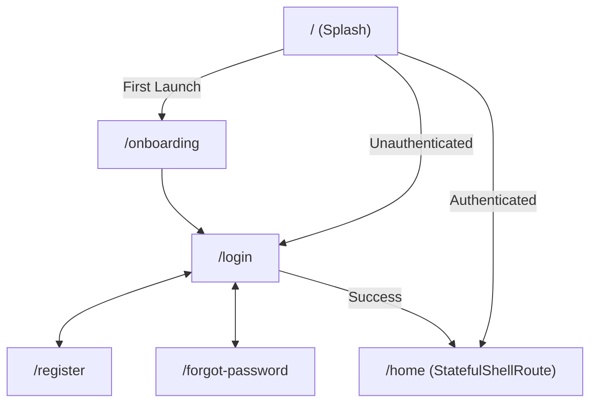

# Waheed Hassan Suits 👔

[](https://flutter.dev)
[](https://dart.dev)
[](https://bloclibrary.dev)
[](#architecture)
[](#)

A modern, scalable Flutter mobile application built for **Waheed Hassan Suits** (E-Commerce & Bespoke Tailoring). Designed with industry-standard practices, this project showcases clean MVVM architecture, feature-driven modularity, robust state management, secure token persistence, and seamless Arabic localization.

---

## 📑 Table of Contents

- [Project Overview](#-project-overview)
- [Key Features](#-key-features)
- [Architecture & Design Pattern](#-architecture--design-pattern)
- [Tech Stack & Libraries](#-tech-stack--libraries)
- [Project Structure](#-project-structure)
- [Networking & Security](#-networking--security)
- [Navigation Flow](#-navigation-flow)
- [Getting Started](#-getting-started)
- [Design & Typography](#-design--typography)

---

## 🌟 Project Overview

**Waheed Hassan Suits** provides customers with a sleek, tailor-made shopping experience. The app allows users to browse premium suits, manage orders, customize selections, and securely handle account operations with high performance and smooth UX.

---

## ✨ Key Features

- **🔐 Robust Authentication Flow**:
  - Secure Login, Registration, and Forgot / Reset Password workflows.
  - PIN / OTP verification via [Pinput](https://pub.dev/packages/pinput).
  - Secure session restoration and persistent login state.
  - Account deletion and safe token wipe.

- **🧭 Stateful Shell Navigation**:
  - Built with [GoRouter](https://pub.dev/packages/go_router) using `StatefulShellRoute.indexedStack`.
  - Preserves scroll positions and state across bottom-bar tabs (`Home`, `Cart`, `Orders`, `Profile`).

- **🛡️ Secure Multi-Tier Storage**:
  - Sensitive authentication tokens (`token`, `refreshToken`) stored via [flutter_secure_storage](https://pub.dev/packages/flutter_secure_storage) (hardware-backed keystore/keychain).
  - User preferences and cache handled via [shared_preferences](https://pub.dev/packages/shared_preferences).

- **🌐 Centralized Network Layer**:
  - [Dio](https://pub.dev/packages/dio) with custom interceptors for Bearer token injection.
  - Automatic `401 Unauthorized` detection with automatic logout and session clearing.
  - Detailed request/response logging using [pretty_dio_logger](https://pub.dev/packages/pretty_dio_logger) in debug mode.

- **🔎 Debounced Search & Dynamic Filtering**:
  - Real-time search query debouncing in `HomeCubit` to prevent excessive API calls and ensure fluid UX.
  - Interactive `FilterBottomSheet` with category chips and price range sliders.

- **🎨 Modern UI & Responsive Layout**:
  - Adaptive screen sizing using [flutter_screenutil](https://pub.dev/packages/flutter_screenutil) (design canvas: `402 x 874`).
  - Full Arabic RTL localization support (`IBMPlexSansArabic` typography).
  - Centralized design tokens via `AppColors` and `AppTextStyles`.
  - Custom UI component library (`AppButton`, `AppInput`, `AppImage`, `AppCountryCode`, `AppBack`, `AppSearchBar`).

---

## 🏛️ Architecture & Design Pattern

The project adheres to **MVVM (Model-View-ViewModel)** with **Feature-First Clean Architecture**:

```
lib/
├── core/                  # Cross-cutting concerns & shared infrastructure
│   ├── di/                # Service locator & dependency registration (GetIt)
│   ├── enums/             # App-wide enumerations
│   ├── network/           # Dio configuration, endpoints & interceptors
│   ├── routing/           # GoRouter route definitions & shell routing
│   ├── storage/           # CacheHelper (Preferences + Secure Storage)
│   ├── utils/             # Helper methods, validators, extensions
│   └── widgets/           # Global reusable UI components
│
└── features/              # Feature modules (isolated & self-contained)
    ├── auth/              # Authentication (Login, Register, OTP, Forgot Password)
    │   ├── logic/         # Cubits & States
    │   ├── models/        # Request & Response Data Models
    │   ├── repositories/  # Remote data source abstraction
    │   └── views/         # UI screens & modular widgets
    ├── home/              # Product showcase & catalogs
    ├── cart/              # Cart management & checkout
    ├── orders/            # Order history & live status tracking
    ├── profile/           # User account, settings & security
    ├── main_layout/       # Bottom navigation shell with indexed stack
    ├── onboarding.dart    # First-launch onboarding screens
    └── splash.dart        # Splash & startup route decision
```

### Dependency Injection (Service Locator)
Dependencies are registered in `lib/core/di/service_locator.dart` using [GetIt](https://pub.dev/packages/get_it):
- **Singletons**: `DioClient`, `AuthRepository`, `ProfileRepository`, `HomeRepository`
- **Factories**: `LoginCubit`, `RegisterCubit`, `ForgotPasswordCubit`, `ProfileCubit`, `HomeCubit`

### Defensive Design & Private Constructors
Purely static utilities, token collections, and configuration classes strictly employ private constructors (`ClassName._()`) to prevent unintentional instantiation:
- `AppRouter._()` — Centralized declarative routing
- `AppColors._()` — Color palette design tokens
- `AppTextStyles._()` — Scaled typography tokens
- `CacheHelper._()` — Secure and preferences storage helper
- `ApiEndpoints._()` — Network URL constants

---

## 🧰 Tech Stack & Libraries

| Category | Package / Tool | Purpose |
|---|---|---|
| **Framework** | [Flutter SDK](https://flutter.dev) | Cross-platform mobile development |
| **State Management** | [flutter_bloc](https://pub.dev/packages/flutter_bloc) | Predictable state handling via Cubits |
| **Routing** | [go_router](https://pub.dev/packages/go_router) | Declarative routing & `StatefulShellRoute` |
| **Dependency Injection** | [get_it](https://pub.dev/packages/get_it) | Inversion of control & service location |
| **Networking** | [dio](https://pub.dev/packages/dio) | HTTP client with interceptors |
| **Logging** | [pretty_dio_logger](https://pub.dev/packages/pretty_dio_logger) | Colorized debug console logs for API traffic |
| **Secure Storage** | [flutter_secure_storage](https://pub.dev/packages/flutter_secure_storage) | Keychain & Keystore AES encryption |
| **Local Storage** | [shared_preferences](https://pub.dev/packages/shared_preferences) | Key-value store for preferences |
| **Responsiveness** | [flutter_screenutil](https://pub.dev/packages/flutter_screenutil) | Dynamic screen adapting across screen sizes |
| **Graphics & Assets** | [flutter_svg](https://pub.dev/packages/flutter_svg), [lottie](https://pub.dev/packages/lottie) | Vector drawings & interactive animations |
| **Image Caching** | [cached_network_image](https://pub.dev/packages/cached_network_image) | Optimized remote image caching & placeholders |
| **Code Verification** | [pinput](https://pub.dev/packages/pinput) | Customized OTP verification pin fields |

---

## 🔒 Networking & Security

```
[UI Layer] ──(Request)──> [Repository] ──> [DioClient]
                                               │
                                       [AppInterceptor]
                                               ├─ Adds 'Bearer <token>' if endpoint is protected
                                               ├─ Handles '401 Unauthorized' (auto-logout & clears storage)
                                               └─ Passes errors/responses cleanly to Cubits
```

- **Protected vs. Public Endpoints**: Identified dynamically; public endpoints (e.g. `/login`, `/register`) do not send authorization headers.
- **Session Expiry**: When token expires (HTTP 401), session data is flushed automatically via `CacheHelper.clearSharedPrefs()` and user is redirected to `/login`.

---

## 🗺️ Navigation Flow



---

## 🚀 Getting Started

### Prerequisites
- [Flutter SDK](https://docs.flutter.dev/get-started/install) (`>= 3.11.1`)
- [Dart SDK](https://dart.dev/get-dart)
- Android Studio / VS Code with Flutter extension
- An Android device / iOS simulator or physical device

### Installation

1. **Clone the repository**:
   ```bash
   git clone https://github.com/Abdul-Rahman-Shokry/waheed_hassan_suits.git
   cd waheed_hassan_suits
   ```

2. **Install project dependencies**:
   ```bash
   flutter pub get
   ```

3. **Verify Flutter environment**:
   ```bash
   flutter doctor
   ```

4. **Run the application**:
   ```bash
   # Run in debug mode
   flutter run
   ```

---

## 🎨 Design & Typography

- **Primary Font**: `IBMPlexSansArabic` (Weights: 400 Regular, 500 Medium, 600 SemiBold, 700 Bold).
- **Default Locale**: Arabic (`ar`) with RTL layout direction.
- **Base Dimensions**: Designed on a `402 x 874` viewport using ScreenUtil for consistent scaling across devices.
- **Color Scheme**: Minimalist luxury palette featuring charcoal, deep black (`#000000`), subtle border tones (`#EAEAEA`), and clean background neutral `#F3F3F4`.

---

## 👨‍💻 Author & Acknowledgements

Developed by **Abdul-Rahman Shokry** as part of Growfet training.
Contributions and feedback are welcome!